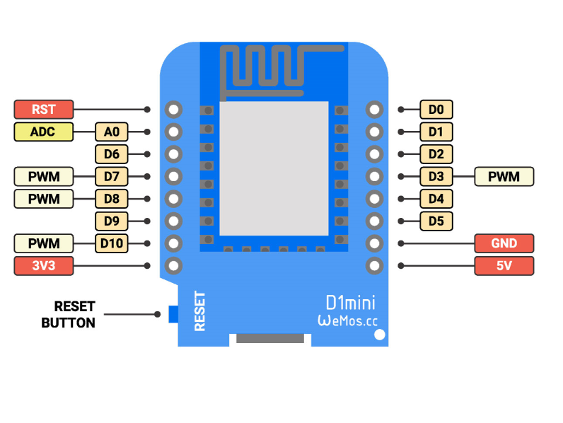
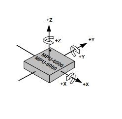

# Preface

Everyone is making cute little cube timers [like this](https://www.amazon.com/Feilifan-Exercise-Management-Countdown-15-20-30-60/dp/B08PB9W3GT/ref=sr_1_2?dchild=1&keywords=Cube+Timer&qid=1615395070&sr=8-2). There's an issue: they suck. The best attempt so far came from an Indiegogo campaign, [TickTime](https://www.indiegogo.com/projects/ticktime-countdown-manage-time-like-never-before#/), and even then was reported to feel light and plastic-y. It also is unclear how to obtain a genuine copy, as multiple sources across the web appear to be selling them "unbranded". More professional attempts have been made that include more sides and fandangoes, but also tie into proprietary apps and have a spotty record when it comes to fulfilment.

This project is an attempt to homebrew a sturdy, hackable version of this product type. 

# Development Platform

## Microcontroller 

- Chip : ESP8266
- On Dev Board : Wemos/Lolin D1 Mini Pro
- 3.3V Logic
- CH340USB Serial Bridge
- Notable Pins:
  - SDA (IIC) - D2
  - SDA(IIC) - D1
  - IMU / SLEEP Interrupt We Are Using : D7
    - Note: This may need to be D0 with some conversion logic on the 8266
  - Speaker ADC : D5

## IMU 

- Chip :  MPU-6050

- On GY-521 Breakout Board

- 5V or 3V Logic

- Bus : IIC  Address : 0x68

- https://www.amazon.com/ZYAMY-MPU-6050-Arduino-Gyroscope-Accelerometer/dp/B0777QVJ4Q

- Calibration Data ( offsets )

  - XAccel : -1981                                 
  - YAccel : 428
  - ZAccel : 1029
  - XGyro :79
  - YGyro : -27
  - ZGyro : -48

- Chip Orientation

  

## Primary Display

- SSD1306 OLED Module
- 128x64 @ 1Bpp
- Bus : IIC Address : 0x3C
- Power Supply Voltages : 7V-12V ( We can drive it with 5V but a boost conv. might give better contrast?)
- https://cdn-shop.adafruit.com/datasheets/SSD1306.pdf

## Speaker Module

- BST1205
- Voltage Range : 4 ~ 6V
- Rated Frequency : 2.4khz
- https://www.digikey.com/en/products/detail/soberton-inc/WT-1205/479674
  - Could not find exact speaker, but this one is very similar.

## Charge Controller Module

- Icstation TP4056 Micro USB 5V 1A Module
- Chip : TP4056
- Has discharge protection
- Waiting for this to come in the mail.

## Battery

- Tenergy 3.7V 700mAh 20C 2.6Wh LIPO Battery
- Charging voltage : 4.2V

## 7-Segment Display x 4

- HiLetgo 2pcs 0.36" 4-Digit Tube LED Segment Display Module Red Common Anode x 2
- Chip : TM1637
- If we want a custom PCB down the line these are readily available, but modules might be easier.

## RGB Momentary Switch

- https://www.ebay.com/itm/10Pcs-Keyboard-Switch-Kailh-Low-Profile-Switch-RGB-SMD-Mechanical-Keyboard/114712388425?hash=item1ab5642349:g:XLYAAOSwUJtgQDNn
- Paired with low profile key caps

# Power Management

## Approximate Power Specifications

Maximum 'On' Time : 24H
Maximum Standby Time : 1 Week
Current Battery Capacity : 700mAh

Current Power Usage, no optimization : 50mA
Current Time On No Optimization : ~14H

Deep Sleep Current : TBD

ESP8266 Logic Level : 3.3v
Voltage Sense Max Voltage: 4.2V ( Lithium Polymer Battery , will need divider )

## Power Saving Strategies

Items are listed in approximately highest to lowest in power savings per list.

### ESP8266 Adjustments

- Use Deep Sleep as often as possible with wakeup interrupt on rising edge of MPU6050.
  - This can be used when the unit is not currently using a function and has not been touched in n seconds.
- Disable WIFI/Bluetooth/Any other unnecessary chip features
- Use lighter sleep modes when applicable.
  - May be able to keep the timers running while lowering clock speed/light sleeping
- Lower clock speeds if tolerance allows

### MPU6050 Strategies

- Use the MP6050 in the lowest power configuration possible
- Disable the ALU that handles PID/Math if not needed

### LCD Adjustments Based on Use Cases

- Turn off non-visible/bottom LCD
- All LCD's that are not the current function LCD can be dimmed.
- Dim LCDs after a time until touched, except the primary LCD
- Turn off all LCDs when no active timer and no active touch

### General

- Poll as infrequently as possible and be reactive with interrupts
- Avoid serial/debug junk in release

# User Stories

// Empty